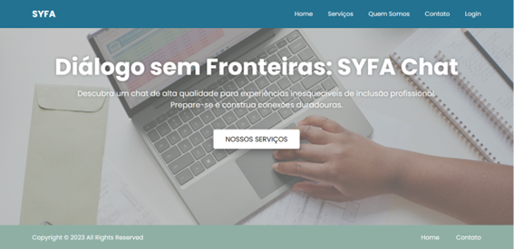
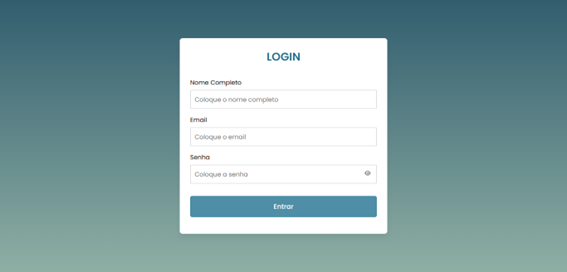
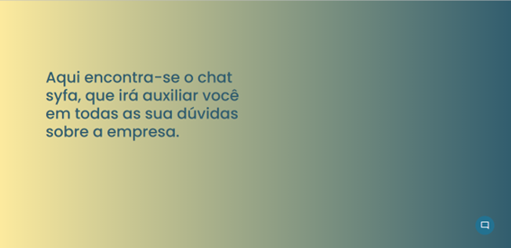
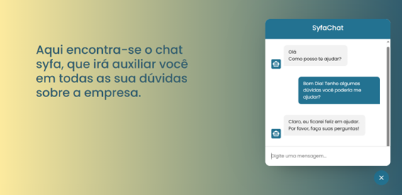

<h1>Projeto SYFA: Chat para Pessoas com Deficiência (PCD) - Voltado para Recursos Humanos (RH)</h1>
<h2>Descrição 📑</h2>
O projeto SYFA (acrônimo para "System for All") é uma plataforma de chat desenvolvida com o objetivo de oferecer suporte e facilitar a comunicação entre pessoas com deficiência (PCD) e profissionais de Recursos Humanos (RH) de empresas e organizações.

A acessibilidade e inclusão são fundamentais para promover a igualdade de oportunidades no ambiente de trabalho. O SYFA disponibiliza um chat com um recurso inicial baseado em Inteligência Artificial (IA) para fornecer assistência e responder perguntas comuns relacionadas a questões de PCD no contexto do RH.

<h3>Recursos Principais</h3>
<h4>Chat com IA:</h4> O SYFA possui um recurso de chat habilitado por IA que permite aos usuários fazer perguntas e obter respostas instantâneas relacionadas a questões de PCD no ambiente de trabalho. A IA foi treinada para entender e responder a uma variedade de perguntas comuns sobre direitos, políticas, acessibilidade e inclusão no RH.
  
<h4>Utilização de API Keys:</h4> Para garantir a segurança e o controle de acesso à plataforma SYFA, são utilizadas API keys. As API keys são chaves de autenticação que permitem o acesso controlado aos recursos e serviços do chat. Elas são geradas e fornecidas aos usuários autorizados, garantindo que apenas pessoas autorizadas possam interagir com a plataforma.
  
Como Contribuir
Reportar Problemas: Se você encontrar algum problema ou identificar oportunidades de melhoria no recurso de chat baseado em IA, sinta-se à vontade para abrir uma issue em nosso repositório no GitHub.
  
<h4>Solicitar Novos Recursos:</h4> Caso tenha alguma ideia ou sugestão para melhorar o SYFA ou adicionar novos recursos, fique à vontade para abrir uma issue no GitHub e compartilhar sua proposta.
  
<h4>Contribuir com o Código:</h4> Se você é desenvolvedor(a) e deseja contribuir diretamente com o desenvolvimento do SYFA, confira nosso repositório no GitHub e siga as instruções para fazer um fork e enviar um pull request.
  
<h2>Tecnologias utilizadas 🖥</h2>

1. JavaScript
2. Html
3. CSS

Descrição do Stack Tecnológico

O projeto SYFA utiliza uma combinação de JavaScript, HTML e CSS para desenvolver a interface de usuário e fornecer funcionalidades interativas e responsivas. O JavaScript é usado para a lógica do lado do cliente, enquanto o HTML é responsável pela estrutura e conteúdo da página. O CSS é utilizado para estilizar os elementos e controlar a aparência do projeto. Além disso, outras bibliotecas e frameworks podem ser utilizados para auxiliar no desenvolvimento, como React, Angular ou Vue.js.

<h2>Funcionalidades</h2>

- Login
- Chat com um recurso inicial baseado em Inteligência Artificial (IA)
  
<h2>Layout</h2>

  
<h2>Coolaboradores</h2>

- Amanda Faustino Magalhaes
- Francielli dos Santos Gonçalves
- Guilherme Soares C. Marinho
- Robson Duarte Morais
- Samoel Tome Barbosa